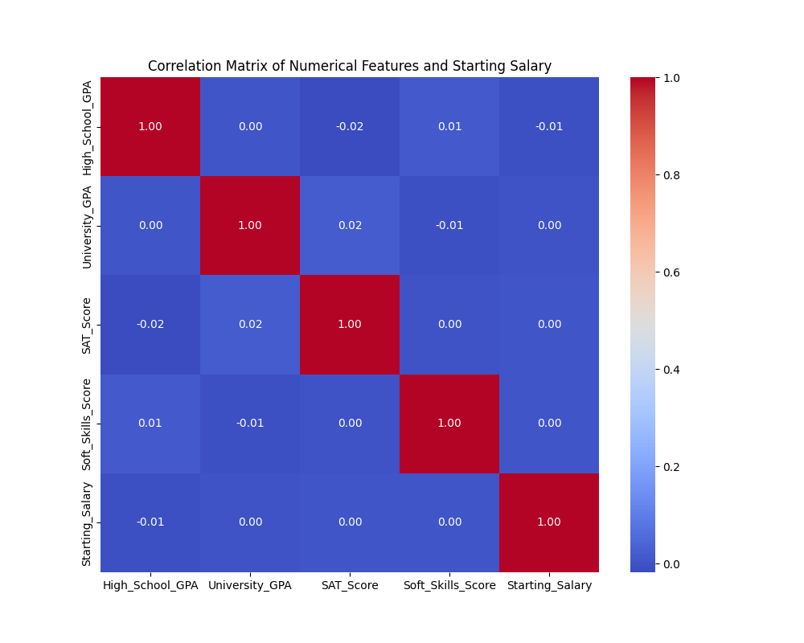
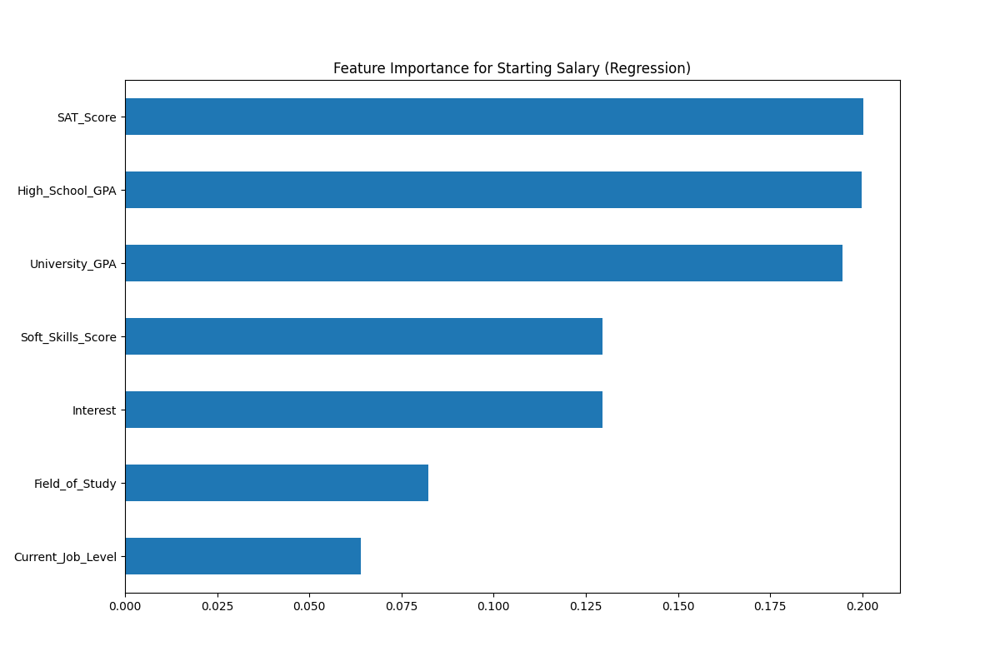
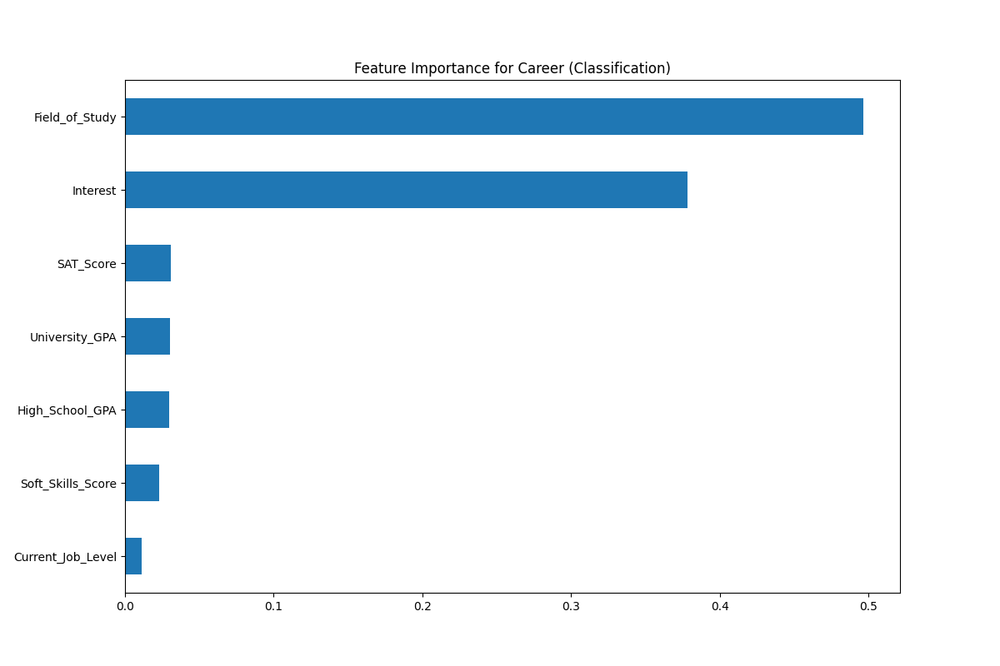
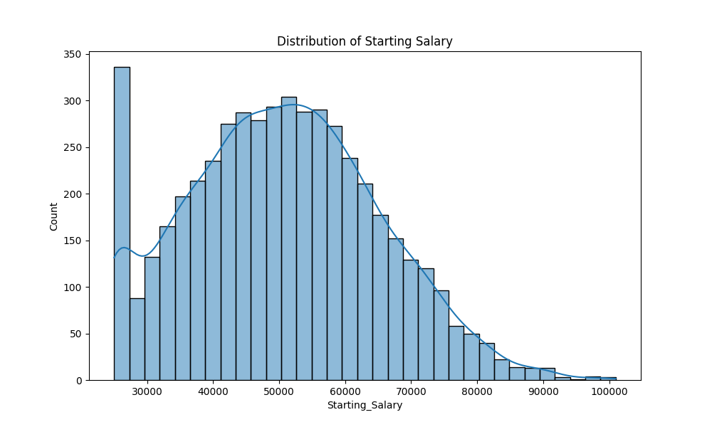
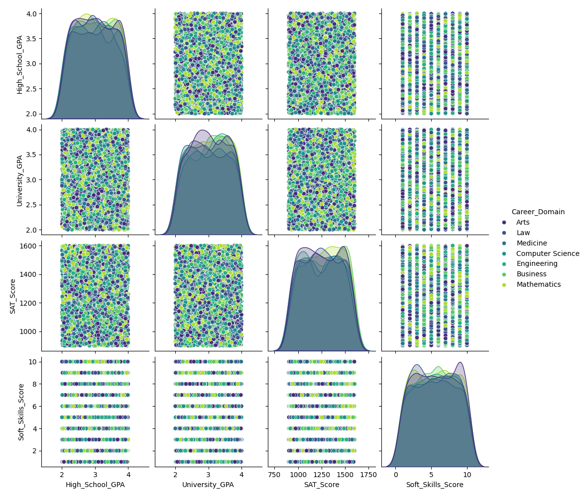
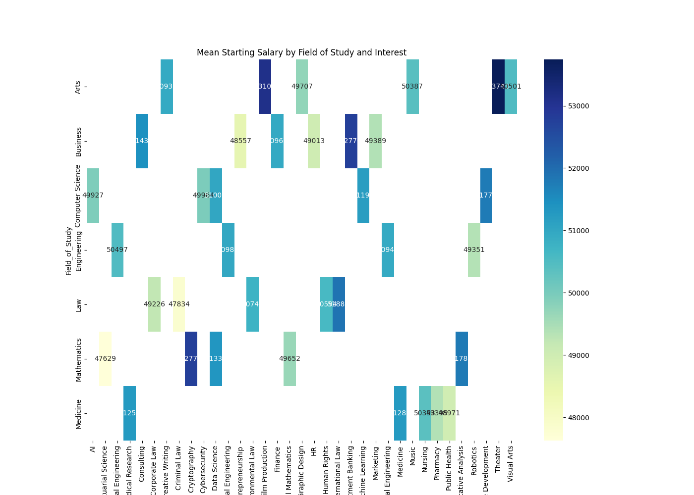
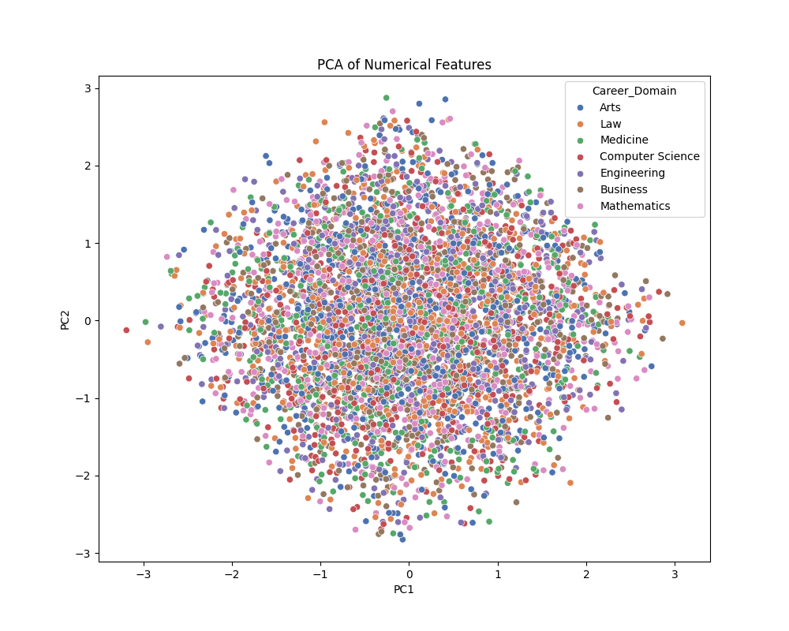
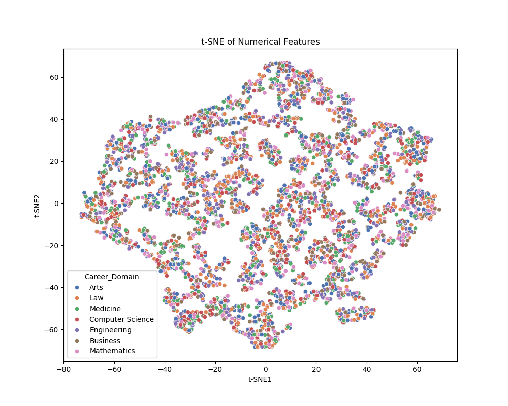

# 📊 Pre-Modeling Feature Analysis Report

This report summarizes the **feature analysis** conducted on the `cleaned_education_data.csv` dataset as part of the FuturePathFinder project. The goal is to evaluate which features are most important for predicting **Starting Salary** (regression) and **Career Domain** (classification), and to visualize key feature relationships.

---

## 1. 🔎 Feature Importance Analysis

### 🔗 Correlation Matrix

We started by examining linear relationships between numerical features and the regression target `Starting_Salary`. The correlation matrix below highlights feature dependencies and potential multicollinearity.

---

### 🌲 ExtraTrees Feature Importance

To assess non-linear relationships and interaction effects, we used **ExtraTrees**, an ensemble-based method, for both regression and classification.

#### 📈 For Regression (Target: `Starting_Salary`)

This plot shows the most influential features for predicting salary.

#### 🎯 For Classification (Target: `Career_Domain`)

This shows which features best distinguish between different career domains.

---

## 2. 📊 Target Variable Distribution

Understanding how target variables are distributed helps inform model type and preprocessing steps.

### 💰 Regression Target: `Starting_Salary`

This histogram reveals the salary distribution — useful for detecting skewness or outliers.

---

### 📚 Classification Target: `Career_Domain`

We evaluated class balance, which is important for classification fairness.

---

## 3. 🔍 Feature Relationship Visualization

### 🧩 Pairwise Relationships

A pairplot was created to show the interaction between important numerical features, grouped by `Career_Domain`.

---

### 🌐 Salary Interaction Heatmap

This heatmap visualizes how combinations of `Field_of_Study` and `Interest` affect mean salary.

---

## 4. 🌈 Dimensionality Reduction

To explore patterns in the high-dimensional feature space, we applied dimensionality reduction techniques.

### 🧮 Principal Component Analysis (PCA)

Reveals global variance and linear separability between domains.

---

### 🌀 t-SNE Visualization

Shows local clustering using a non-linear manifold learning technique.

---

## 5. ✅ Business Rule Validation

A domain-specific mapping was applied to remove illogical combinations of `Field_of_Study` and `Interest`. This ensures data quality and contextual alignment.

> Example Rule:
> - Field: `Engineering` should not map to Interest: `Creative Writing`.

🔎 Outcome:
- Removed rows that violated domain mappings
- Improved logical consistency in the dataset

---

## 6. 🧪 Train-Test Split Preparation

Finally, a **stratified train-test split** was performed using `Career_Domain` as the stratification key. This preserves class proportions across both training and testing sets — essential for accurate and unbiased modeling.

---

## 📁 Output Directory

All plots are saved in:
